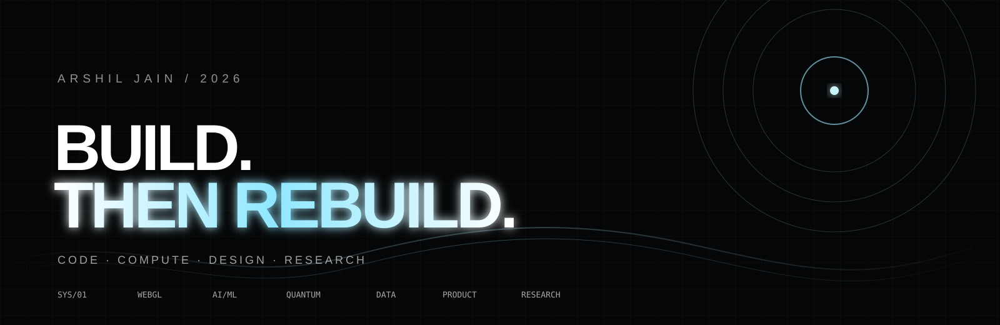

<!--
  ARSHIL JAIN — PROFILE README
  Visual language: dark / editorial / systems.
-->

 

  

---

<table>
<tr>
<td width="54%" valign="top">

### 01 / WHO

I like building at the intersection of **software, mathematics, data, and visual design**.

Right now I am moving between:

- interactive web / WebGL
- AI + machine learning
- data science
- quantum computing + Qiskit
- experimental product ideas

I care about two things:

**Does it work?**  
**Does it feel unforgettable?**

</td>
<td width="46%" valign="top">

### 02 / CURRENT STACK

~~~text
LANGUAGES
Python · JavaScript · TypeScript
C/C++ · SQL · R

SYSTEMS
Git · Linux · Docker
APIs · Automation · CI/CD

AI / DATA
NumPy · pandas · scikit-learn
PyTorch · Jupyter

QUANTUM
Qiskit · quantum algorithms
linear algebra · simulation

CREATIVE
Three.js · WebGL · GLSL
Next.js · React · Framer Motion
~~~

</td>
</tr>
</table>

---

## 03 / SELECTED WORK

<table>
<tr>
<td width="50%" valign="top">

### ◌ Lusion Systems

**[lusionw](https://github.com/arshiljain/lusionw)**

A technical deep-dive into high-performance interactive graphics: shaders, GPGPU dynamics, runtime behavior, screen-space effects and mathematical geometry.

**Focus:** WebGL · GLSL · GPU systems · mathematics

</td>
<td width="50%" valign="top">

### ◇ Experimental Web

**[lusion](https://github.com/arshiljain/lusion)**

An exploration of immersive web direction — motion, composition, interaction and the kind of frontend work that sits closer to art direction than a standard landing page.

**Focus:** Three.js · interaction · creative frontend

</td>
</tr>

<tr>
<td width="50%" valign="top">

### △ AI Website Cloner

**[ai-website-cloner-template](https://github.com/arshiljain/ai-website-cloner-template)**

A reusable starting point for turning reference websites into structured, editable web experiences.

**Focus:** AI tooling · frontend systems · automation

</td>
<td width="50%" valign="top">

### ⌘ Github Bot

**[Github-Bot](https://github.com/arshiljain/Github-Bot)**

Automation experiments around GitHub workflows and developer tooling.

**Focus:** Python · automation · APIs

</td>
</tr>
</table>

### more experiments → [github.com/arshiljain](https://github.com/arshiljain?tab=repositories)

---

## 04 / GITHUB SIGNAL

  

&nbsp;

  

---

## 05 / BUILDING PHILOSOPHY

~~~text
MAKE IT USEFUL.
MAKE IT FAST.
MAKE IT BEAUTIFUL.
THEN MAKE IT STRANGE.
~~~

I would rather build one project someone remembers than ten projects nobody opens.

---

## 06 / FIND ME

 

Built with curiosity. Shipped with intent.

